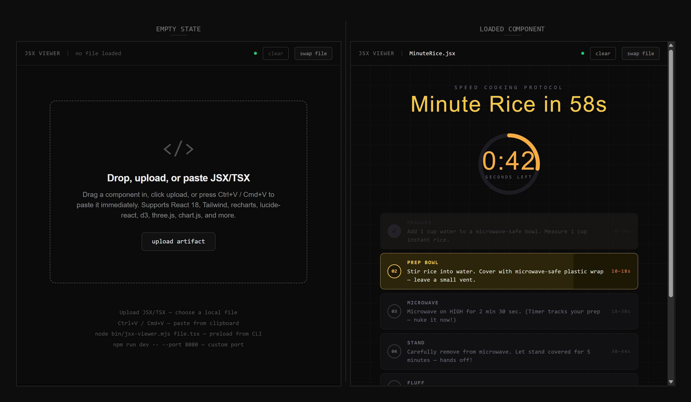

# jsx-viewer

Render `.jsx` and `.tsx` files as easily as `.html`. One command, one file, rendered.



You get a `.tsx` or `.jsx` artifact from Claude, ChatGPT, or wherever. To actually *see* it, you'd normally scaffold a React app, install deps, wire up imports, run a dev server. That's 5 minutes of ceremony for 2 seconds of viewing. `jsx-viewer` skips all of it.

```bash
git clone https://github.com/pszemraj/jsx-viewer.git
cd jsx-viewer
npm install

npm start        # empty drop/upload/paste UI
# npm run demo     # preloads the example dashboard
```

The viewer opens in your browser. You're done.

## Requirements

`jsx-viewer` currently requires **Node 20.19.0+ or 22.12.0+** because the
repo now builds and serves through **Vite 8**.

Node `18.x`, `21.x`, `20.0.0` through `20.18.x`, and `22.0.0` through
`22.11.x` are not supported. The package advertises that floor via
`package.json#engines`, and the CLI/build scripts fail early with a direct
message when the runtime is too old.

## Usage

There are four ways to get a component on screen:

**Start with a file** (recommended) - pass it directly and it's watched for changes. Save in your editor, browser updates.

```bash
node bin/jsx-viewer.mjs path/to/Component.tsx
# optional, only after global install/link:
jsx-viewer path/to/Component.tsx
```

`.tsx` is the preferred artifact format, but `.jsx` continues to work.

**Drag and drop** - start with no args (`npm start`), drag a `.jsx` or `.tsx` file onto the browser window.

**Upload a file** - start with no args (`npm start`), click `upload artifact`, and choose a local `.jsx` or `.tsx` file.

**Paste source** - start with no args, focus the viewer window, and press `Ctrl+V` / `Cmd+V`. No extra paste button is required.

An included TSX example dashboard is available via `npm run demo`.

When a file is already loaded, use the toolbar `swap file` button to replace it directly, or `clear` to return to the empty drop/upload/paste state.

### Options

```bash
node bin/jsx-viewer.mjs [options] [file.jsx|file.tsx]

  -p, --port <n>   Viewer HTTP port (default: 3142, max: 65534)
                   WebSocket listens on port + 1
  -v, --version    Show version
  -h, --help       Show help
```

If you globally install/link the package, the same command becomes `jsx-viewer [options] [file.jsx|file.tsx]`.

Pass zero or one `.jsx` / `.tsx` file. Unknown flags, duplicate `--port`
arguments, unsupported input extensions, and extra positional arguments fail
fast with a usage error instead of silently falling back to another workflow.

WebSocket runs on port + 1 (default: 3143). The browser auto-opens on startup
unless `CI` is already set.
Because the WebSocket reserves the next port, the highest supported viewer
port is `65534`.

### Component requirements

Your JSX/TSX file needs a **default export** of a React component:

```tsx
export default function MyComponent() {
  return <div>Hello</div>;
}
```

Wrapped exports created with `React.memo(...)`, `forwardRef(...)`, or `lazy(...)`
are supported too, as long as the default export is still renderable with no props.
`lazy(...)` exports render behind the viewer's built-in `Suspense` boundary while
their module resolves.

## Reference

### How it works

1. **Vite dev server** handles JSX/TSX transpilation and HMR, with its dependency cache redirected into a checkout/install-specific temp workspace
2. Your file is copied to a **transient runtime slot** in that same user-writable temp directory
3. Vite picks up the change and hot-reloads the browser instantly
4. A **WebSocket bridge** connects the browser UI to the CLI for drag-and-drop/paste
5. On exit, the transient slot is cleared - your file is never committed, and packaged/global installs never need to write into their install prefix

`component/View.tsx` remains a tracked placeholder file for the repo and package.
`npm run slot:reset` restores that placeholder and clears inactive transient runtime slots plus stale temp Vite cache entries for the current checkout/install without interrupting live viewers.
If startup fails after a file was requested (for example, a port conflict),
`jsx-viewer` clears the transient runtime slot before exiting.

### Pre-installed libraries

These are available for `import` in your JSX/TSX files with no setup:

| Package      | Version | Notes              |
| ------------ | ------- | ------------------ |
| react        | 18.x    | Hooks, etc.        |
| react-dom    | 18.x    |                    |
| recharts     | 2.x     | Charts/graphs      |
| lucide-react | 0.383.x | Icons              |
| d3           | 7.x     | Data visualization |
| three        | 0.164.x | 3D graphics        |
| lodash       | 4.x     | Utilities          |
| mathjs       | 13.x    | Math operations    |
| papaparse    | 5.x     | CSV parsing        |
| chart.js     | 4.x     | Canvas charts      |
| tone         | 15.x    | Audio synthesis    |

**Tailwind CSS v3** is compiled locally via PostCSS - no CDN, no external network calls. Works fully offline and behind corporate firewalls. JIT recompiles on every slot swap, so arbitrary utility classes just work.

If your artifact imports something not listed here, `npm install` it and restart the viewer. Vite picks it up automatically.

### Dev commands

| Command                     | Purpose                                         |
| --------------------------- | ----------------------------------------------- |
| `npm start` / `npm run dev` | Launch the empty drop/upload/paste UI           |
| `npm run demo`              | Preload and watch `example/Dashboard.tsx`       |
| `npm run slot:reset`        | Restore `component/View.tsx` and clear inactive runtime slots/cache for this checkout |
| `npm run guard:slot`        | Fail if `component/View.tsx` differs from the placeholder |
| `npm test`                  | Run the CLI, protocol, runtime, and UI test suite |
| `npm run lint`              | Run ESLint                                      |
| `npm run typecheck`         | Run TypeScript and checked-JS type-checking     |
| `npm run build`             | Production build to `dist/`                     |

On non-Windows systems, `npm install` also configures a repo-local pre-commit hook that blocks commits when `component/View.tsx` has been changed away from the tracked placeholder.

On Windows, hook installation is skipped by default because Git-for-Windows shell hooks can be flaky in some environments. The guard still exists as `npm run guard:slot`.

If you still want the hook on Windows, opt in explicitly before install:

```powershell
$env:JSX_VIEWER_ENABLE_GIT_HOOKS='1'
npm install
```

For POSIX shells, the equivalent is:

```bash
JSX_VIEWER_ENABLE_GIT_HOOKS=1 npm install
```

## License

MIT
